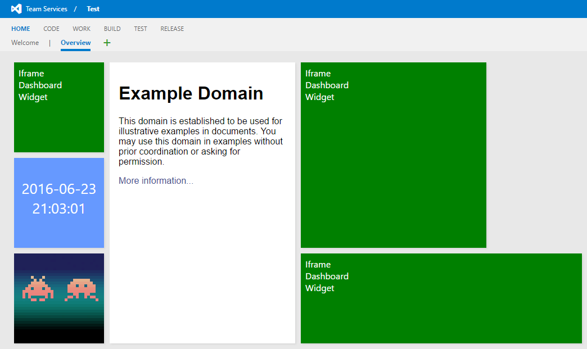
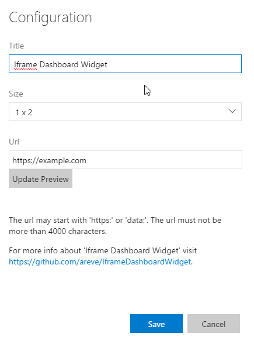

#Iframe Dashboard Widget#
A dashboard widget to show an Iframe in TFS/VSTS.

The widget allows you to show any page easily in your VSTS dashboard.

The url may be in any format but 'https:' and 'data:' urls work best.  'http:'
urls will not work due to browser security.

## Some examples of how you can use

## The configuration pane

