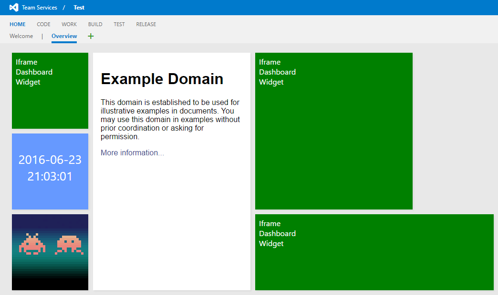
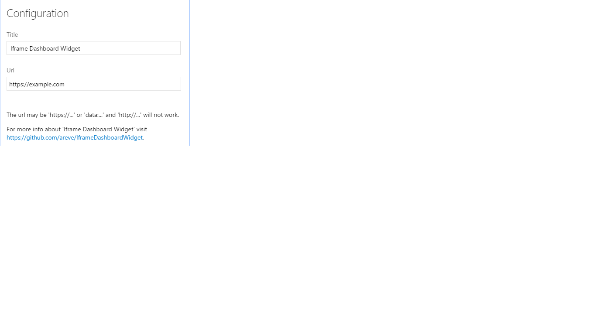

# **Iframe Dashboard Widget** - A dashboard widget to show an Iframe in TFS/VSTS.

The widget allows data from a web page to be added easily in your VSTS dashboard.

The url may start with 'https:' or 'data:'.  If you are using TFS on 'http:' you may also use 'http:'. Urls that start with 'http:' will not work in VSTS because of browser security restrictions and so are not supported.

[Here](https://github.com/areve/IframeDashboardWidget) you can find the source code and you can install it accessing [here](https://marketplace.visualstudio.com/items?itemName=areve.iframe-dashboard-widget)

## Examples

Follows an image showing an example of usage:

Urls used in the screenshot above.

 * `https://example.com`
 * `data:text/html,<html><body style="background-color:#69f;color:#fff;font:26px Segoe UI,Frutiger,Frutiger Linotype,Dejavu Sans,Helvetica Neue,Arial,sans-serif">

</body></html>`
 * `data:image/png;base64,iVBORw0KGgoAAAANSUhEUgAAAKAAAACgCAMAAAC8EZcfAAAAGXRFWHRTb2Z0d2FyZQBBZG9iZSBJbWFnZVJlYWR5ccllPAAAAGZQTFRFAAAA5qSHD3x3GVt46Y9+EX5955mCCWJaDG5kHyFYAQwLHTZlB1ZNDXZvHENsE4CAGGZ9FnCBGk9zBDgxHitfAykk7oGC5LCMBkhA7H9/Bkg+64N9AhoW47yTHx9Y6od9FHyCFXiCMeX0bwAAAWdJREFUeNrs1dlSwkAQRmEQXHAD3MC4IO//kjpeRDPVM5mJUH/HOoebJEx3fTepTBYH6T20OEYTgADHAqwiRIcH8r/HAAIcDTC/5jBvsbUFIMDxAwe+/KUvOkCA/x1Y/72LzgEE6A04cE39p650AiBAOfDBeQAByoFXzgMIUA68zfYWKnh2vAAClAPv+tuEoqv6NtmSYwAByoGzbNNUs5qmhVmzAAHKgatUZ/2t+rMmkrfWUoAA5cC10bwturWerbPNq4sWAAQoB+677Ya1T/XnVQAByoEf3V5CP1f5ool80VjyWRRAgHLgsttzKLqyqjqXPBz9Ya0CCFAOPF1+/X7VvX1qs27zlZ7LjwEEKAeeOA8gQDnwxnkAAcqBF84DCFAOPHceQIBy4LXzAAKUA5vQNtS0bVM1Rslz28LyWwAClAPvnQcQoBz46DyAAOXAV+cBBCgHXjoPIEA5kIiIiIiIiIj89inAACi4uO54C29hAAAAAElFTkSuQmCC`

## Configuration
You can confugure:
- the widget title;
- the size;
- the widget url.

Follows an imagem showing how to configure the widget:

